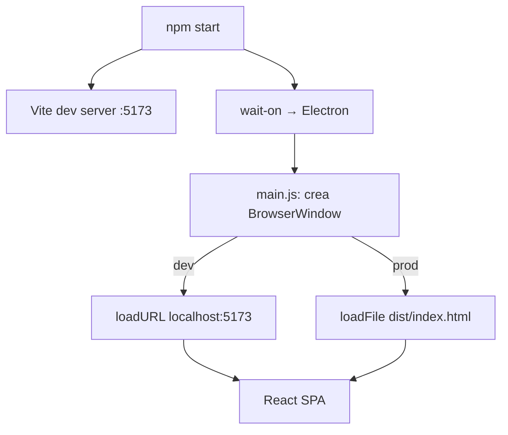
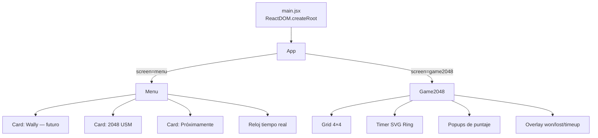
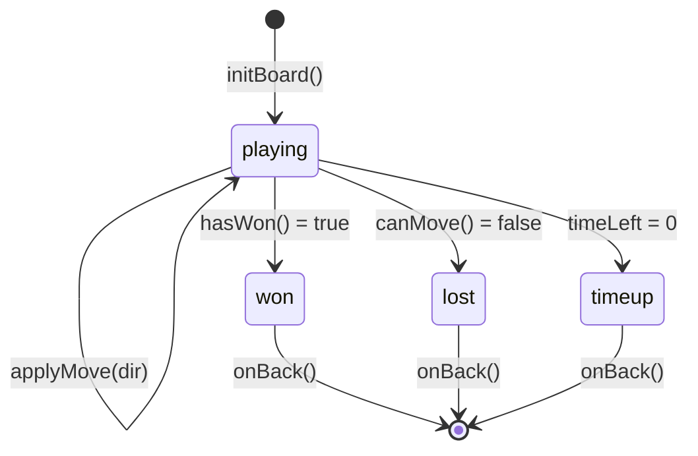

# Arquitectura — Tótem Interactivo USM

## Visión general

```
┌─────────────────────────────────────┐
│            Electron 33              │
│  ┌────────────────────────────────┐ │
│  │       BrowserWindow            │ │
│  │    1080×1920 px (portrait)     │ │
│  │                                │ │
│  │  ┌──────────────────────────┐  │ │
│  │  │       Vite / React       │  │ │
│  │  │                          │  │ │
│  │  │  App.jsx (router)        │  │ │
│  │  │  ├── Menu.jsx            │  │ │
│  │  │  └── Game2048.jsx        │  │ │
│  │  └──────────────────────────┘  │ │
│  └────────────────────────────────┘ │
└─────────────────────────────────────┘
```

## Flujo de procesos Electron



## Arquitectura de la SPA React



## Patrón de navegación

La app usa un **router manual** basado en `useState` en `App.jsx`. No usa React Router ni ninguna librería de routing.

```javascript
// App.jsx
const [screen, setScreen] = useState('menu');
// screen: 'menu' | 'game2048'
```

**Por qué**: Para una app kiosk con 2-3 pantallas, React Router sería over-engineering. El estado simple es suficiente y más fácil de mantener.

**Limitación**: Sin historial de navegación, sin deep linking, sin animaciones de transición nativas.

## Gestión de estado

Sin librería de estado global (Redux, Zustand, Context). Todo es estado local por componente:

| Componente | Estado que maneja |
|-----------|------------------|
| `App.jsx` | `screen` activo, `toast` visible |
| `Menu.jsx` | `pressed` (animación de card) |
| `Game2048.jsx` | `board`, `score`, `best`, `timeLeft`, `status`, `scorePops`, `touchStart` |
| `Clock` (en Menu) | `now` (hora actual, actualiza c/seg) |

## Ciclo de vida del juego 2048



## Seguridad Electron

```javascript
// main.js — configuración segura
webPreferences: {
  nodeIntegration: false,    // Node no accesible desde renderer
  contextIsolation: true,    // Contexto JS aislado
  preload: path.join(__dirname, 'preload.js')
}
```

El `preload.js` actualmente solo hace un `console.log`. En el futuro, si se necesita comunicación IPC (ej: guardar scores), debe usarse `contextBridge` aquí.

## Estructura de archivos vs responsabilidades

| Directorio | Responsabilidad |
|-----------|----------------|
| `main.js` | Proceso principal Electron, ciclo de vida de la ventana |
| `preload.js` | Bridge seguro entre main y renderer (actualmente mínimo) |
| `src/screens/` | Vistas completas (pantalla entera) |
| `src/components/` | Componentes reutilizables entre pantallas |
| `src/games/` | Un subdirectorio por juego, autocontenido |
| `public/` | Assets estáticos servidos sin procesamiento (pendiente) |
| `src/assets/` | Assets importados por Vite (pendiente entrega USM) |

## Consideración crítica: Android

Electron **no corre en Android**. Ver [`ANDROID.md`](ANDROID.md) para las tres opciones de despliegue cuando se confirme el hardware.
