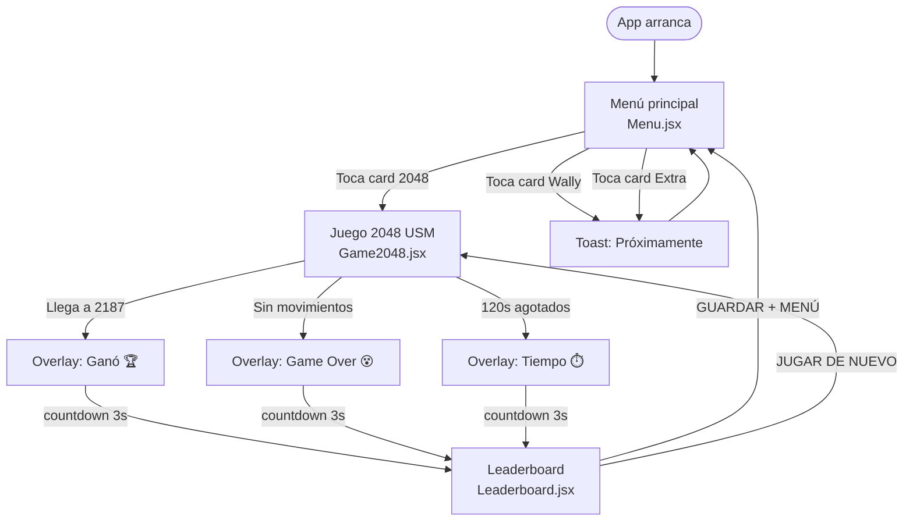
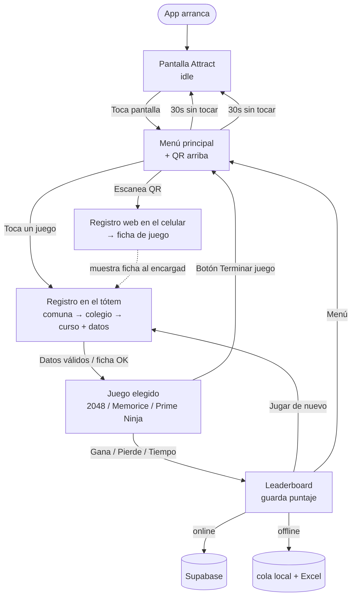
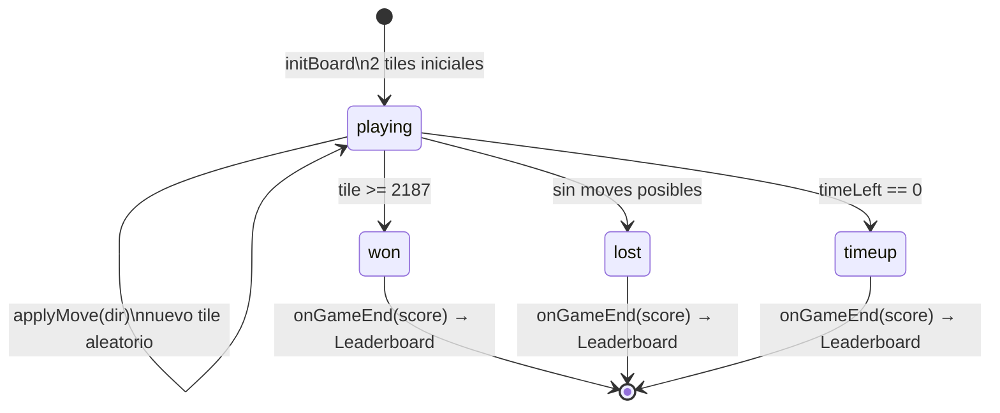

# Flujo de Juego — Tótem Interactivo USM

## Flujo actual (implementado)

> **Nota**: `Attract.jsx` está implementada pero aún no conectada al flujo. Se conectará en Fase 8.
> El card de Wally se elimina en la Fase 0.

---

## Flujo objetivo v2 (roadmap post-reunión)

> Se pide registro **antes de cada juego** (aunque el alumno se repita); si viene pre-registrado por
> QR, se identifica por código y salta el tipeo. Dedup por RUT evita duplicados.

---

## Estados del juego 2048

### Detalles del estado `playing`

| Evento | Condición | Resultado |
|--------|-----------|-----------|
| Swipe | |dx| > |dy| y > 25px | `applyMove('left'/'right')` |
| Swipe | |dy| > |dx| y > 25px | `applyMove('up'/'down')` |
| Tick de timer | `timeLeft > 0` | `timeLeft -= 1` |
| Merge | tiles iguales adyacentes | nuevo valor = val × 3 |
| Tile nuevo | después de cada move válido | 90% = 3, 10% = 9 |

### Colores de tiles por valor

| Valor | Color | Significado visual |
|-------|-------|--------------------|
| 3 | Azul oscuro (#002a5c→#003d80) | Inicio |
| 9 | Azul medio | — |
| 27 | Azul (#0055a5→#0070cc) | — |
| 81 | Azul claro | — |
| 243 | Azul brillante | — |
| 729 | Celeste | — |
| **2187** | Dorado (#ffd700→#ff8c00) | **Victoria** |
| 6561 | Rojo-Rosa | Post-victoria |

---

## Reglas del juego 2048 USM

1. **Grid**: 4×4 = 16 celdas
2. **Inicio**: 2 tiles aleatorios (valor 3 o 9)
3. **Movimiento**: deslizar todas las tiles en una dirección
4. **Merge**: dos tiles iguales adyacentes se fusionan en una nueva con valor × 3
5. **Puntaje**: cada merge suma el valor resultante al score
6. **Victoria**: alcanzar una tile con valor **2187** (3⁷)
7. **Derrota**: no quedan celdas vacías ni merges posibles
8. **Tiempo**: 120 segundos por partida — al agotarse, se muestra el puntaje

---

## Componentes de UI del juego 2048

| Componente | Función |
|-----------|---------|
| `TimerRing` | SVG circular con countdown. Cambia de color: azul → naranja (30s) → rojo (10s) |
| `ScorePop` | Popup flotante dorado que muestra `+N` puntos en cada merge |
| `Tile` | Celda con animación de aparición (scale 0→1) y merge (scale 1.15→1) |
| `EmptyTile` | Celda vacía con fondo translúcido |
| Overlay | Se superpone al tablero cuando el juego termina |
